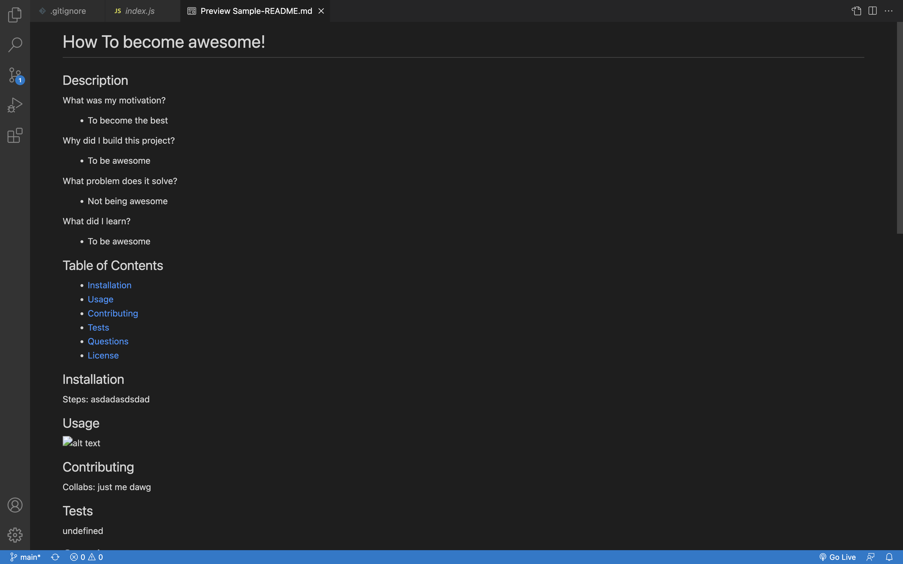

# README GENERATOR

  ## Description

  What was my motivation?
  - My motivation for this Readme Generator was to create an question based system to generate a professional grade Readme

  Why did I build this project?
  - I build this project to keep my future projects effiecent and professional

  What problem does it solve?
  - This project solves the issue of having a poor readme

  What did I learn?
  - I learned how to program an automated system using node.js to create files
  

  ## Table of Contents

  - [Installation](#installation)
  - [Usage](#usage)
  - [Contributing](#contributing)
  - [Tests](#tests)
  - [Questions](#questions)
  - [License](#license)

  ## Installation

  Step 1: In your integrated terminal for index.js  run: npm init
  
  Step 2: Then procede with "npm i" This goes and downloads the dependencies
  
  Step 3: Next write "node index.js" to start the system
  
  Step 4: Follow the instructions and make sure to read them carefully
  
  Step 5: Enjoy your professionaly generated readme!

  ## Usage

  

  ## Contributing

  The Contributors to this is project than yours truly: myself and I

  ## Tests

  No Tests were created for this project

  ## Questions

  Github Profile: josephpicardat

  If you need to reach me, you can with through my email: josephpicardat1@gmail.com

  ## License

  
  (https://opensource.org/licenses/MIT)

  Copyright 2022 Joseph Picardat

  Permission is hereby granted, free of charge, to any person obtaining a copy of this software and associated documentation files (the "Software"), to deal in the Software without restriction, including without limitation the rights to use, copy, modify, merge, publish, distribute, sublicense, and/or sell copies of the Software, and to permit persons to whom the Software is furnished to do so, subject to the following conditions:

    The above copyright notice and this permission notice shall be included in all copies or substantial portions of the Software.
    
    THE SOFTWARE IS PROVIDED "AS IS", WITHOUT WARRANTY OF ANY KIND, EXPRESS OR IMPLIED, INCLUDING BUT NOT LIMITED TO THE WARRANTIES OF MERCHANTABILITY, FITNESS FOR A PARTICULAR PURPOSE AND NONINFRINGEMENT. IN NO EVENT SHALL THE AUTHORS OR COPYRIGHT HOLDERS BE LIABLE FOR ANY CLAIM, DAMAGES OR OTHER LIABILITY, WHETHER IN AN ACTION OF CONTRACT, TORT OR OTHERWISE, ARISING FROM, OUT OF OR IN CONNECTION WITH THE SOFTWARE OR THE USE OR OTHER DEALINGS IN THE SOFTWARE.

